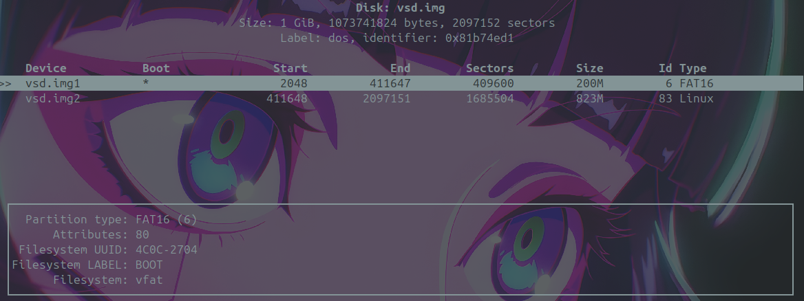

# Embedded Linux Development

### Create a 1 GiB Virtual Disk Image and explain the command you use.

-  used the command dd
    ```bash
    dd if=/dev/zero of=vsd.img bs=1M count=1024
    ```
- dd copies data from a linux driver file "/dev/zero" that outputs null bytes to a file named "vsd.img" 1 mb at a time.

### Define what is the difference between the DOS/MBR and GPT partition schemes/type.

- MBR (Master Boot Record) is an older partitioning scheme that supports up to 4 primary partitions and a maximum disk size of 2 TB.
- GPT (GUID Partition Table) is a newer partitioning scheme that supports up to 128 partitions and a maximum disk size of 9.4 ZB. GPT includes redundancy and CRC protection for the partition table.

### Define what is the difference between different File systems and Its usage (FAT16, sFAT32, and EXT4)

- fat16 is used for older systems and has a maximum file size of 2 GB and a maximum partition size of 4 GB, used because all systems support it.
- fat32 is an improvement over fat16, supporting a maximum file size of 4 GB and a maximum partition size of 8 TB. It is widely used for USB drives and SD cards.
- ext4 is a Linux file system, supporting large file sizes and partitions.

## Formatting and Partition the Virtual Disk Image.



 Commands used:
```bash
# Create the file with the size of 1 GiB
dd if=/dev/zero of=vsd.img bs=1M count=1024
# Create a partition table and a primary partition
cfdisk vsd.img
# Format the partition with FAT16 file system
mkfs.vfat vsd.img1 -n BOOT -f 16 
# Format the partition with EXT4 file system
mkfs.ext4 vsd.img2 -L rootfs
```
### Define what is the Loop Devices, why Linux use them.

- Loop devices are virtual block devices that allow you to mount a file as if it were a physical disk. They are used in Linux to access and manipulate disk images. 
- Loop devices enable you to work with disk images without needing to write them to physical media, making it easier to test and develop embedded Linux systems.

1. Command to create a loop device
    ```bash
    sudo losetup --show -P -f vsd.img
    ```
1. Command to list all loop devices currently in use.
    ```bash
    sudo losetup -a
    ``` 
1. Command to detach a (Mounted)loop device
    ```bash
    sudo losetup -d /dev/loop0
    ```
### How can you check the current loop device limit?

- Using this command:
    ```bash
    cat /sys/module/loop/parameters/max_loop
    ```
    but this limit is only for the preallocated loop devices (made during boot), the system can dynamically create more loop devices as needed.

### Can you expand the number of loop devices in Linux?

- Yes by using losetup to create more devices.
- or if u mean the max, by using the following command:
    ```bash
    sudo modprobe loop max_loop=64
    ```

### Attach the Virtual Disk Image as a Loop Device.

- Using the following command:
    ```bash
    sudo losetup --show -P -f vsd.img
    ```

### Format the Virtual Disk Image Partitions fat and ext4.

- For FAT16:
    ```bash
    mkfs.vfat /dev/loopxp1 -n BOOT -f 16 
    ```
- For EXT4:
    ```bash
    mkfs.ext4 /dev/loopxp2 -L rootfs
    ```

### Explain what you Know about the “mount” and “unmount” Linux Command.

- **`mount`**: is used to attach a filesystem to a specified directory in the Linux file system hierarchy. It allows you to access the contents of the filesystem.

- **`unmount`**: is used to detach a mounted filesystem from the directory it was attached to.

### What is the difference between the block device vs character device.

- **Block Device**: A block device is a type of device file that provides buffered access to hardware devices. It allows for random access to data in fixed-size blocks. like hard drives and USB drives.

- **Character Device**: A character device is a type of device file that provides unbuffered access to hardware devices. It allows for sequential access to data, meaning you can read or write one character at a time. like keyboards and serial ports.

### Create Mount Points and Mount the Virtual Disk Image Partitions.

- if u have a gui and the partitions formatted correctly, then the system can automatically mount them, but if not, you can do it manually using the following commands:

    - Create mount points:
        ```bash
        sudo mkdir -p /mnt/boot
        sudo mkdir -p /mnt/rootfs
        ```
    - Mount the partitions:
        ```bash
        sudo mount /dev/loopxp1 /mnt/boot
        sudo mount /dev/loopxp2 /mnt/rootfs
        ```
