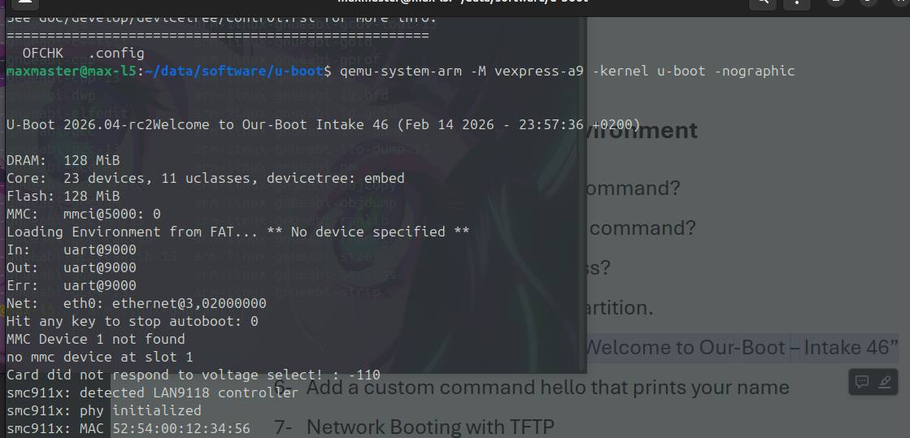
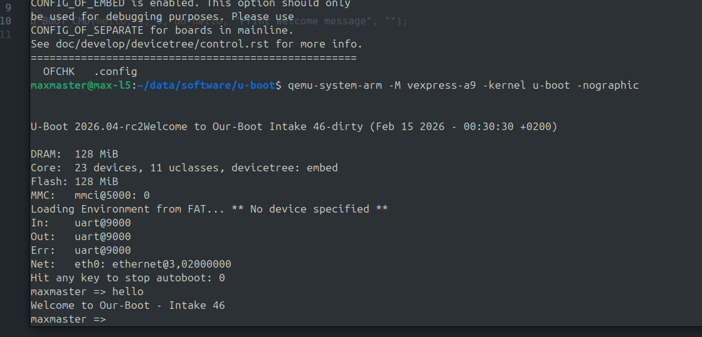

# U-Boot Task


## Part A:

### Define what you Know about the bootloader?

A bootloader is a small app that runs when a computer or is powered on. Its function is to initialize the hardware and load the OS into memory. The bootloader is responsible for setting up the necessary environment for the OS to run, including configuring the CPU, memory, and peripherals.

### Draw and Explain the exact boot chain on Raspberry Pi from power-on until you see the U-Boot prompt.

1. on power-on, the rpi's GPU starts and executes the code stored in the boot ROM. This code is responsible for initializing the hardware and selecting the appropriate boot device.

1. The boot ROM looks for the bootloader on the SD card and loads it into memory. the file is called `bootcode.bin`.

1. The `bootcode.bin` initializes the SDRAM and loads the next stage bootloader, `start.elf`, which is responsible for loading the U-Boot bootloader.

1. The `start.elf` loads the U-Boot bootloader, which is responsible for loading the OS kernel and providing a command-line interface for the user to interact with.

### What is the difference between U-Boot and GRUB?

- U-Boot is primarily used in embedded systems and is designed to be lightweight. It supports a wide range of architectures and used in devices like routers, and single-board computers like the rpi.

- GRUB is a more complex bootloader that is commonly used in desktop and server environments. It supports a wide range of operating systems and file systems.

### What files must be placed in the Raspberry Pi boot partition to boot U-Boot, and define what is the important of each of them?

1. `bootcode.bin`: This file is responsible for initializing the hardware and loading the next stage bootloader.

1. `start.elf`: This file is responsible for loading the U-Boot bootloader.

1. `u-boot.bin`: This is the U-Boot bootloader itself, which is responsible for loading the OS kernel and providing a command-line interface for the user to interact with.

1. `config.txt`: this file tells start.elf the name of the U-Boot binary to load and other hardware-specific configurations.

### Build and Test Custom U-Boot in QEMU (Cortex-A9)

#### Build U-Boot , Customize U-Boot via menuconfig, and Explain the steps you took to build it.

```bash
# set up the cross-compilation environment for ARM architecture
export CROSS_COMPILE=arm-linux-gnueabi-

# setup the default configuration for the vexpress_ca9x4 board (virtual board)
make vexpress_ca9x4_defconfig

# customize the U-Boot configuration using menuconfig
make menuconfig

# build
make -j
```

### Which file provides the hardware description to U-Boot on the Raspberry Pi 3B+ and at which stage is it loaded?

the dtb file, and it is loaded by the U-Boot bootloader after it is loaded into memory (runtime).


### After losetup --partscan --show -f sd.img we get devices like /dev/loop5p1 and /dev/loop5p2. Explain how the Linux kernel knows where the partitions start inside the image file.

the kernel looks for the partition table (mbr) in the image file, which contains information about the start and end of each partition. The kernel uses this information to create device nodes for each partition, such as /dev/loop5p1 and /dev/loop5p2, which can then be accessed like regular block devices.

## Part B: U-Boot Commands Environment

### What is the using of “bdinfo” command?

- print Board Info structure

### What is the using of “printenv” command?

- print environment variables

### What is the DRAM start address?

- 0x60000000

### List and Load Files from FAT Partition

```bash
# list files in the FAT partition
ls mmc 0:1

# load a file from the FAT partition into memory
load mmc 0:1 0x60000000 <filename>
```

### Make the U-Boot banner say “Welcome to Our-Boot – Intake 46”

done via menuconfig 46




### Add a custom command hello that prints your name





### Network Booting with TFTP

- Set Up a TFTP Server on Your Laptop
    ```bash
    mkdir /srv/tftp
    sudo apt install tftpd-hpa
    sudo chown -R tftp:tftp /srv/tftp
    sudo chmod -R 755 /srv/tftp
    sudo systemctl restart tftpd-hpa
    sudo systemctl status tftpd-hpa
    ```
- From U-Boot
    ```bash
    setenv serverip 192.168.2.1   # PC IP
    setenv ipaddr 192.168.2.2      # rpi IP
    tftp $kernel_addr_r rpi _app
    ```

### What is the difference between run and go commands?
- run: executes a U-Boot environment variable as a command.

- go: jumps to an address in RAM and starts executing code there.

### What is the purpose of bootargs and who reads it?
- it is an environment variable used to pass parameters to the Linux kernel when it boots.
- the kernel reads it.

### Why do we use 0x62000000 and not 0x60000000 for kernel address on Raspberry Pi?
- i didn't, but i imagine we don't because the 2nd one might be reserved.