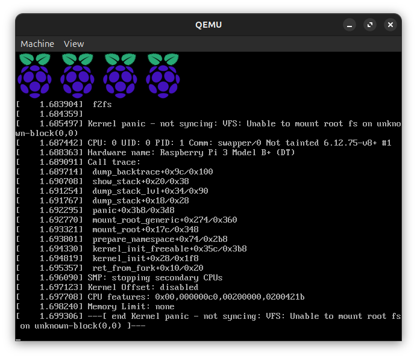
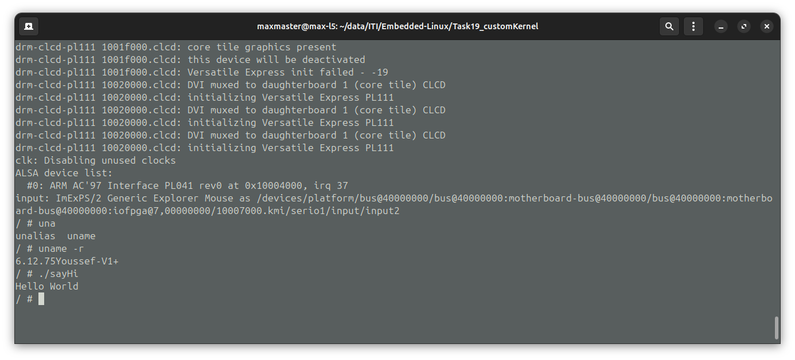

# Custom Linux Kernel

## commands & notes

```bash
./q_run.sh  # to run qemu 
```

image from rpi emulator:


image from vexpress with BusyBox


some commands to laod the images

```bash
    # load the dtb file
    fatload mmc 0:1 $fdt_addr_r dtb.dtb
    # load the image
    fatload mmc 0:1 $kernel_addr_r Image 
    # booti <kernel_addr> <initramfs_addr> <dtb_addr>
    booti $kernel_addr_r - $fdt_addr_r
```

## Notes

- use `tty0` for console in bootargs if you wanna use qemu
- the arrangement of the `-serial`s in the **q_run.sh** matters
- you can use the dtb generated from the kernel with uboot

## Task Q/A

### 1. What is the difference between a monolithic kernel and a microkernel? Where does Linux stand Linux?

> Linux is a monolithic kernel

- A monolithic kernel has all of its compont inside the kernel space.
- A microkernel has a small kernel and runs all other parts ie... networking, fs, drivers as processes that communicate using ipc.

### 2. Why does almost every embedded device (phones, TVs, cars, routers) use Linux instead of a true real-time microkernel like QNX?

- because QNX is not free.
- linux is, and supports alot of devices.

### 3. What is Android GKI (Generic Kernel Image)? Why did Google force all vendors to use it from Android 13?

- Google is trying to make the linux image used by android devices vendors a standerd
- that can help with security, since the security patches will be applied much faster
- vendors now create there own HW drivers as loadable kernel modules.

### 4. Why clone raspberrypi/linux instead of torvalds/linux for RPi?

- it takes alot of time for drivers to reach the main kernel, so by cloaning rpi's fork, we get the latest rpi HW support

### 5. Explain the difference between these kernel images

> vmlinux - zImage - Image  uImage - Image.gz

- vmlinux:
  - the main kernel elf file
  - has the debug symbols
  - uncompressed
  - used to create all other images

- zImage:
  - a compressed kernel image
  - used for arm systems
  - faster to load
  - has a small decompressor (the image extracts itself)

- Image:
  - image with the debug symbols removed
  - just a binary file
  - uncompressed

- Image.gz:
  - gzip compressed image
  - does not have the compresser used in zimage
  - bootloader has to decompress it
- uImage:
  - uBoot specific image
  - has a header that contains:
    - compression type
    - load address
    - checksum
    - entry point

### 6. Why fdt_addr_r for DTB? What is DTB?

- DTB is **device tree binary**, it is a compiled version of the DTS (**Device Tree Source**) which is a file that discribes the components of the board, and the addresses.
- the dtb is loaded into this address so that uboot and the kernel know what drivers to load.

### 7. Explain bootargs: root= rootfstype= console= init=

> bootargs are vars passed to the kernel when it boots,  used to setup some stuff

- root: the rootfs block device (location of root)
- rootfstype: the type of the rootfs (who could've seen that) 🤷 -> ext4
- console: where the kernel messages are printed
- init: the init process (the first program that runs)

### 8. Why bootz for ARM32, booti for ARM64?

- bootz is used with zImages wchich is typically the foramat used in arm32 boards
- this does not work with normal `noncompressed` Images in arm64

### 9. What causes "VFS: Unable to mount root fs" panic?

- no rootfs
- no driver for the rootfs type
- in bootargs `root=` is not set

### 10.Why does custom init.c need -static? What if not?

- cause the system still has not loaded the dynamic libs (if they even exist)
- if the `-static` flag is not given to the compiler, the executable will be dynamicly linked which will fail when booting

### 11. You passed init=/bin/sh but it still panics. Why?

- could be dynamicly linked.
- the path maybe incorrect or doesn't exist

### 12. Why must your custom init program be statically linked? What happens if you forget -static?

- same as Q10
