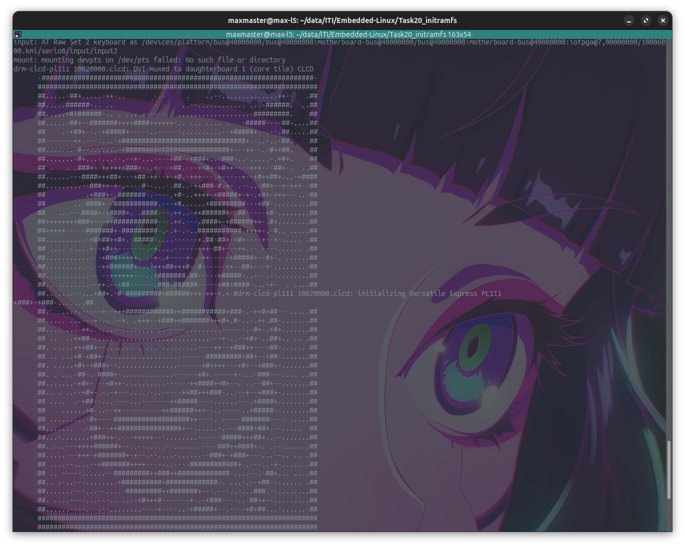
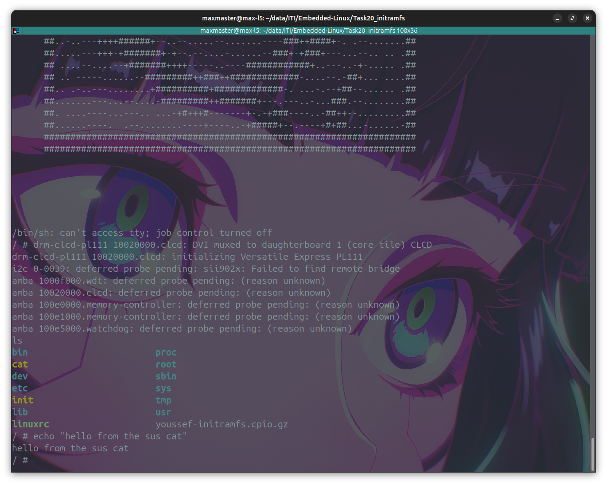

# initramfs Lab

## Questions

### 1. What is initramfs? Why use it instead of mounting the real rootfs directly?

- is a temporary filesystem that the kernel extracts into ram very early in the boot process before the real rootfs is mounted.
- it is used because of its small size it can be loaded fast to finish initing the system

### 2. Why cpio format for initramfs? Why not tar or zip?

- because it is simpler than tar and tar and zip are not supported outof the box

### 3. What does rdinit= do? What happens if wrong path?

- tells the kernel where is the init process in the initramfs
- kernel panic ¯\\_(ツ)_/¯

### 4. Why must init be statically linked? What if dynamic?

- it is not a must (i did it with dynamic libs)
- you just need to copy the libs aswell
  - but if the libs do not exist the booting will fail

### 5. Difference: initramfs vs initrd ?

- initrd: a ram disc is a block storage
- initramfs: a cpio archive

### 6. Where is initramfs loaded in memory? Who decompresses it?

- loaded into an address specified by uboot
- decompressed by the kernel

### 7. How does kernel switch from initramfs to real rootfs?

- using the chroot command after mounting the real rootfs
