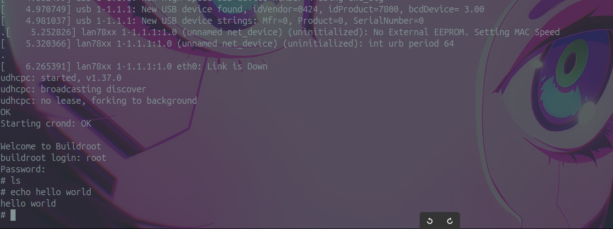

# BuildRoot Task



## notes

if ur ganna use qumu u have to make the sd image to be a pow(2, n) so 1GIB, 2, 4 and so on
with this:

```bash
qemu-img resize sdcard.img 1G   # or any other size 
```

## Questions

### 1. Why does Buildroot generate an sdcard.img with two partitions (FAT boot + ext4 root) automatically, while in one single command, but in Labs 01–08 we had to do everything manually? What is the real advantage of this approach in a real product?

- cause thats what BL does, it generates all reqired files to run a linux image, and adds them to an image for ease of use.

- it:
  - installs cross compiler
  - compiles kernel
  - compiles dts
  - builds bootloader
  - gets libs from the internet

so whats a couple more commands to package everything

- the advantage is speed & ease of configuration

### 2. Buildroot is extremely popular for small-to-medium embedded systems, but very large projects (Android, automotive, set-top boxes) use Yocto instead. In 2–3 sentences, explain the main reason why Yocto wins on huge, multi-board, long-term projects while Buildroot wins on single-board, fast prototypes

- Yocto is built with the concept of reusable layers, which makes it easy for large teams to share code across many boards and maintain devices in the field for years.

- Buildroot skips all that structure — it just builds a single root filesystem quickly and simply, which is perfect for one developer on one board, but breaks down when you need to scale.
