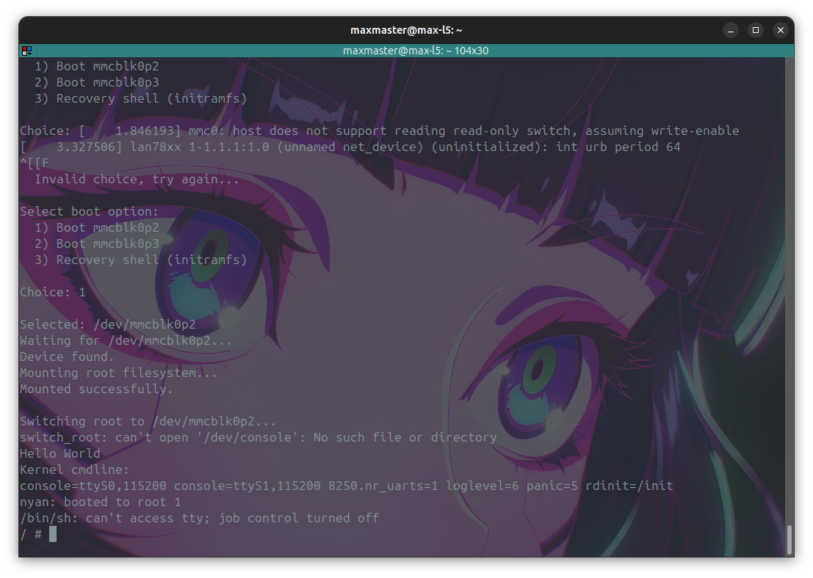
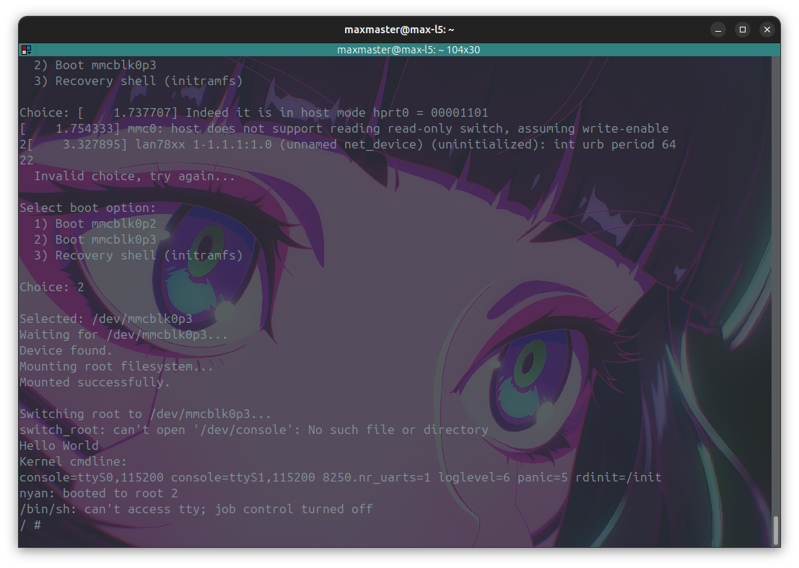

# DualBoot Task

## boot images




## commands used

### creating initramfs

```bash
cd initramfs
find . | cpio -H newc -o | gzip > ../initramfs.cpio.gz
cd ..
# use correct path to mkimage
~/data/software/u-boot/tools/mkimage -A arm64 -T ramdisk -C gzip -d initramfs.cpio.gz initramfs.uboot
```
